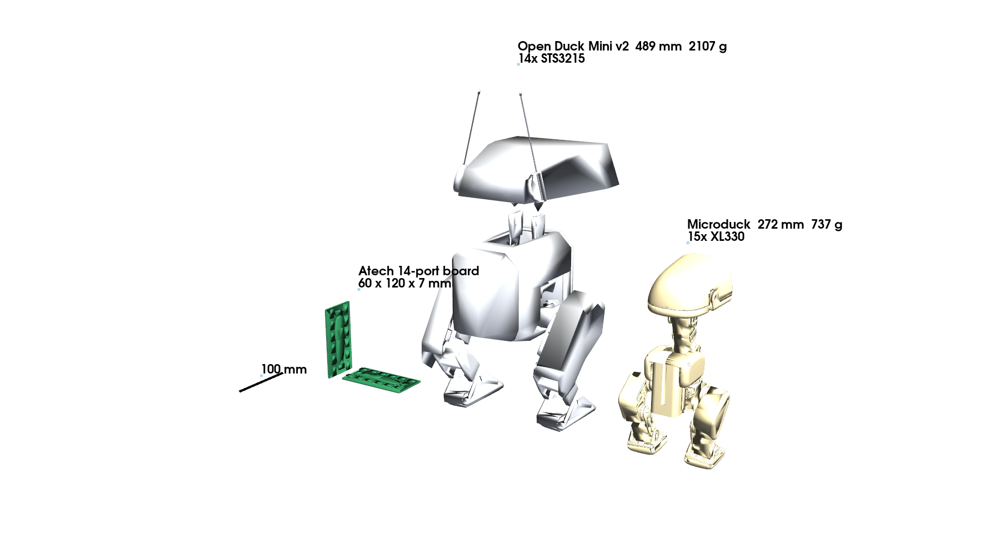

# Atech Duck

Recreating the Hugging Face / Pollen Robotics **Microduck** (25 cm RL biped, launched
2026-08-27) on the **Atech** modular electronics platform. Concept, reference geometry,
firmware. See `DESIGN.md` for the brief and the decisions, `BOM.md` for parts, `WIRING.md` for
the Atech modules, ports and cables.



## Layout

```
DESIGN.md                 the brief: what the Microduck is, routes, recommended concept, plan, questions
BOM.md                    parts and prices; mechanical section generated from the CAD
cad/                      atech_duck_stand.glb (posed, full resolution, duck colours) + BOM.csv
WIRING.md                 Atech modules, ports, servo chain, power, head cable, bring-up order
reference/                upstream repos (gitignored; scripts/fetch_reference.sh) + reference/README.md
scripts/assemble_mjcf.py  pose an MJCF robot -> out/<name>.stl/.glb + docs/anatomy_<name>.md
scripts/render_reference.py  docs/img/reference_lineup.png
docs/anatomy_*.md         joints, link lengths, masses of both reference ducks
scripts/sim_walk.py       headless MuJoCo run of the ODM v2 walking policy (stock / +Atech board) -> out/motion/*.json
scripts/duck_parts.py     shared loader: every part of the ODM v2 high-res export + the Atech board, colours, kinds
scripts/replay_hires.py   forward kinematics of the recorded run on the full-resolution part export (+ full-res meshes, binary)
scripts/export_cad.py     -> cad/atech_duck_stand.glb (posed CAD, one node per part) + out/atech_duck_stand.stl
scripts/build_bom.py      -> cad/BOM.csv + the generated mechanical section of BOM.md
scripts/build_motion_page.py  -> docs/motion_page.html (interactive 3D replay of the high-res assembly)
scripts/duck_controller.py  policy controller factory for `partsmith motion atech_duck`
docs/motion_sim.md        simulation results
docs/motion_page.html     interactive 3D replay (open in a browser; duck / CAD / grey colour schemes)
firmware/                 PlatformIO project for the Atech 14-port board (ESP32-S3)
  src/duck_config.h       joint table (ODM v2 order, bus IDs, init pose), loop constants
  src/duck_bus.*          Feetech STS bus driver for N servos (SYNC READ / SYNC WRITE)
  src/policy.*            MLP runner; src/policy_weights.h generated from an ONNX policy
  src/main.cpp            OFF / STAND / POLICY / LIMP state machine, JSON serial protocol
  tools/onnx_to_header.py ONNX -> policy_weights.h (checked against onnxruntime)
  lib/athera_modules/     Atech drivers (IMU, ToF, speaker, NeoPixel, button, robot_arm) copied 2026-09-02
```

## Quick start

```bash
cd ~/projects/atech_duck
python3 -m venv .venv && .venv/bin/pip install onnx onnxruntime numpy scipy trimesh pyvista pyyaml
scripts/fetch_reference.sh                                   # ~350 MB of upstream repos
.venv/bin/python scripts/assemble_mjcf.py reference/microduck_rl/src/mjlab_microduck/robot/microduck/robot_walk.xml microduck \
    --keyframe STAND --scene reference/microduck_rl/src/mjlab_microduck/robot/microduck/scene.xml
.venv/bin/python scripts/assemble_mjcf.py reference/Open_Duck_Playground/playground/open_duck_mini_v2/xmls/open_duck_mini_v2.xml open_duck_mini_v2 \
    --keyframe home --scene reference/Open_Duck_Playground/playground/open_duck_mini_v2/xmls/scene_flat_terrain.xml
.venv/bin/python scripts/render_reference.py
.venv/bin/python firmware/tools/onnx_to_header.py reference/Open_Duck_Mini/BEST_WALK_ONNX_2.onnx firmware/src/policy_weights.h
cd firmware && pio run            # build; pio run -t upload once a board is on USB
```

## CAD

`cad/atech_duck_stand.glb` is the Open Duck Mini v2 assembly at full part resolution (357 k
faces, 87 parts, no decimation) in the STAND pose, with the Pi Zero and BNO055 removed and the
Atech 14-port board in the trunk. The earlier `out/open_duck_mini_v2.stl` came from the
Playground model's convex hulls and is only good for physics. The servo bodies are not in the
upstream visual export, so the CAD shows horns, sheets and shells but no STS3215 housings.

## Status (2026-09-02, CAD + BOM 2026-09-09)

- Reference: fetched, posed, measured. No public 3D scan exists; the official simulation
  meshes are the geometry (CC BY-NC-SA). Open Duck Mini v2 (Apache-2.0) is the open body
  this concept uses.
- Motion simulation: the walking policy runs the full body in MuJoCo, stock and with a
  60 g Atech board; neither falls, the board costs ~5 % forward speed. `docs/motion_sim.md`.
- Firmware: compiles for both envs (`atech_duck`, `atech_duck_bare`). Not flashed — no
  board or servo was connected. `BENCH` on a real board is the first measurement.
- Nothing printed or ordered. Gustav's decisions: `DESIGN.md` §8.

## Third-party content

- `firmware/lib/athera_modules/` — Atech module drivers (subset of the Atech firmware library, copied 2026-09-02).
- `firmware/src/policy_weights.h` — exported from `BEST_WALK_ONNX_2.onnx`, Open Duck Mini v2 (Apache-2.0).
- The Open Duck Mini v2 body, meshes and runtime contract are Apache-2.0 (apirrone/Open_Duck_Mini).
- Microduck meshes (Pollen Robotics, CC BY-NC-SA 4.0) are not in this repo; `docs/img/` shows renders of them for reference only. `scripts/fetch_reference.sh` re-downloads the upstream repos.
